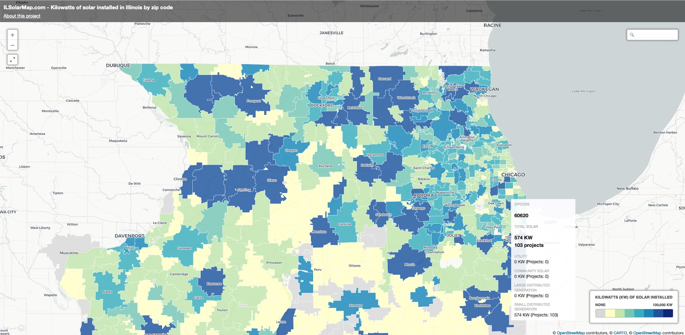

# il-solar-map

Data prep for ILSolarMap.com. 

Read more about ILSolarMap.com here: https://docs.google.com/document/d/1V4BLQhhcFK38FIupAo-gKgJXOfpIzCbdwdtMYjgMeBI/edit



## Setup
We recommend using [virtualenv](http://virtualenv.readthedocs.org/en/latest/virtualenv.html) and [virtualenvwrapper](http://virtualenvwrapper.readthedocs.org/en/latest/install.html) for working in a virtualized development environment. [Read how to set up virtualenv](http://docs.python-guide.org/en/latest/dev/virtualenvs/).

Once you have virtualenvwrapper set up, do this:

```bash
mkvirtualenv il-solar-map -p /path/to/your/python3
pip install -r requirements.txt
```

## Running the Script

To run everything:

```bash
cd data/v2/scripts
bash run_all.sh
```

You can also run each script individually from the `data/v2/scripts` folder:

```bash
# combine 3 source files into one
python combine_projects.py

# assign il house and senate districts based on tract centroids
python get_tract_districts.py

# aggregate data by county, tract and legilsative districts
python aggregate_data.py
```

## Data sources

Boundary sources

* Illinois Counties - https://clearinghouse.isgs.illinois.edu/data/reference/illinois-county-boundaries-polygons-and-lines
* Illinois State Senate Districts (2023) - https://www.elections.il.gov/shape/
* Illinois State House Districts (2023) - https://www.elections.il.gov/shape/
* Illinois Census Tracts - https://www2.census.gov/geo/tiger/TIGER2020PL/STATE/17_ILLINOIS/17/

Solar project sources

* Illinois Adjustable Block Program projects (Illinois Power Agency)
* Illinois Solar for All program (Illinois Power Agency)
* Utility solar projects (US EIA Energy Atlas)
