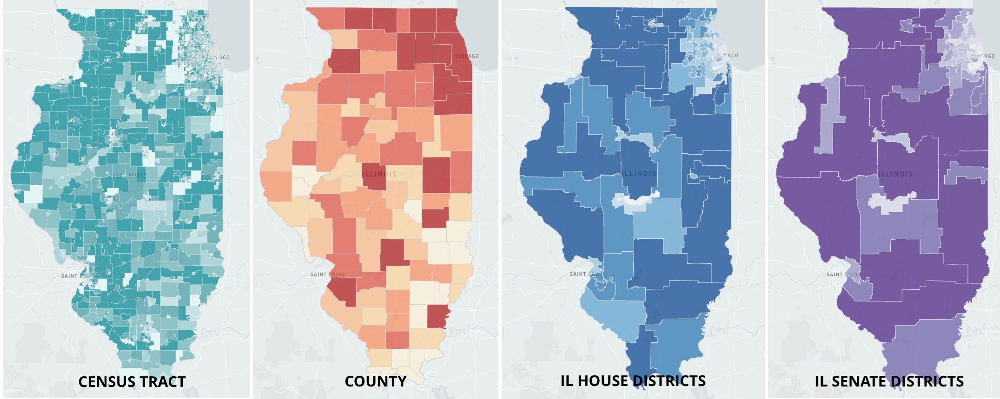

# il-solar-map

Website and data prep for ILSolarMap.com. 



## Setup
We recommend using [virtualenv](http://virtualenv.readthedocs.org/en/latest/virtualenv.html) and [virtualenvwrapper](http://virtualenvwrapper.readthedocs.org/en/latest/install.html) for working in a virtualized development environment. [Read how to set up virtualenv](http://docs.python-guide.org/en/latest/dev/virtualenvs/).

Once you have virtualenvwrapper set up, do this:

```bash
mkvirtualenv il-solar-map -p /path/to/your/python3
pip install -r requirements.txt
```

## Running the data aggregation scripts

To run everything:

```bash
cd data/scripts
bash run_all.sh
```

## Setting up and running the website 

This site uses Jekyll to serve several static pages and images. The site is published to GitHub Pages.
### Dependencies

* [Jekyll](http://jekyllrb.com/) - Static site generator built in Ruby
* [Bootstrap 5](http://getbootstrap.com) - HTML and CSS layouts
* [mapbox-gl-js 2.15](https://docs.mapbox.com/mapbox-gl-js/guides)
* [jQuery 3.7](https://jquery.com/)
* [DataTables](http://datatables.net) - for searching and sorting tables
* [CSV to HTML Table](https://github.com/derekeder/csv-to-html-table) - for sortable rollup tables

### Running locally

Requirements:

* ruby-2.6.2
* jekyll 3.1.6

We recommend using [rvm](https://rvm.io/) to manage your Ruby versions.

Initial setup
```console
git clone https://github.com/chihacknight/il-solar-map.git
cd il-solar-map
rvm install ruby-2.6.2
bundle install jekyll -v 3.1.6
bundle install
```

Running locally
```console
jekyll serve -w
```

Then open your web browser and navigate to http://localhost:3000

## Data sources

Boundary sources

* Illinois Counties - https://clearinghouse.isgs.illinois.edu/data/reference/illinois-county-boundaries-polygons-and-lines
* Illinois State Senate Districts (2023) - https://www.elections.il.gov/shape/
* Illinois State House Districts (2023) - https://www.elections.il.gov/shape/
* Illinois Census Tracts - https://www2.census.gov/geo/tiger/TIGER2020PL/STATE/17_ILLINOIS/17/

Solar project sources

* Illinois Adjustable Block Program projects (Illinois Power Agency) - https://illinoisabp.com/project-application-reports/
* Illinois Solar for All program (Illinois Power Agency)
* Utility solar projects (US EIA-860M) - https://www.eia.gov/electricity/data/eia860m/

Legislator info

* Illinois State Senate Members - https://ballotpedia.org/Illinois_State_Senate
* Illinois State House Members - https://ballotpedia.org/Illinois_House_of_Representatives